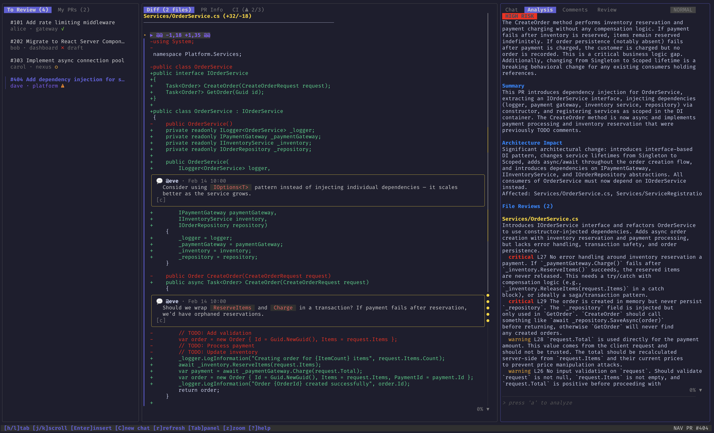

# prtea

A terminal dashboard for reviewing GitHub PRs with AI-powered analysis.

**Website:** [prtea.paulie.app](https://prtea.paulie.app/)



Three-panel TUI built with [Bubbletea](https://github.com/charmbracelet/bubbletea): browse your PRs, read diffs, and chat with an AI sidekick (powered by the [Codex CLI](https://github.com/openai/codex)) about the changes — all without leaving the terminal.

## Features

- **Three-panel layout** — PR list, diff viewer, and AI chat side by side with toggleable panels and zoom
- **AI sidekick** — press `a` for a "what is this PR, what's risky, where do I look" overview, then keep asking
- **Live activity feed** — see the commands and reasoning the agent runs while it works, message by message
- **Safe by design** — the agent runs in a read-only sandbox with no network; GitHub actions it proposes (post a comment, reply, submit a review) execute only after you confirm them in the TUI
- **Hunk selection** — select specific diff hunks to focus the AI conversation on what matters
- **Review basket** — draft inline comments on diff lines with `c`, see them queued in the Review tab, and submit them together with your verdict as one review
- **CI status** — dedicated tab showing check results grouped by status
- **Review status** — per-reviewer approval breakdown with visual badges
- **Comments** — read and post PR comments with full markdown rendering; review threads show their resolved state
- **Custom prompts** — per-repo review instructions for tailored AI context
- **Search in diff** — `/` to search, `n`/`N` to navigate matches with highlighting
- **Command palette** — `Ctrl+P` for quick commands, `:` for full mode with autocomplete
- **Thread persistence** — conversations resume where you left off when revisiting PRs (real codex session resume, not history replay)
- **Vim-style navigation** — j/k, Ctrl+d/u, g/G, and modal editing in chat

## Prerequisites

- [GitHub CLI](https://cli.github.com/) (`gh`) — authenticated with `gh auth login`
- [Codex CLI](https://github.com/openai/codex) (`codex`) — optional, required for AI chat and PR orientation; sign in with your ChatGPT account

For releasing: `gh` CLI and access to the `../homebrew-tap` sibling repo.

## Installation

### Homebrew

```bash
brew install shhac/tap/prtea
```

### GitHub Releases

Download from the [releases page](https://github.com/shhac/prtea/releases), extract, and add to your `$PATH`.

### Build from Source

Requires [Go](https://go.dev/) 1.25+.

```bash
git clone https://github.com/shhac/prtea.git
cd prtea
make build
```

The binary is written to `bin/prtea`. Move it somewhere on your `$PATH`:

```bash
cp bin/prtea /usr/local/bin/
```

## Usage

```bash
prtea
```

Check your installed version with `prtea --version`.

Launch from any directory. The PR list loads your review requests and authored PRs from GitHub.

### Demo Mode

Try prtea without any prerequisites:

```bash
prtea --demo
```

Demo mode loads 6 fictional PRs with realistic diffs, comments, CI statuses, and reviews, plus a scripted AI engine — no `gh` or `codex` CLI needed. Write operations (approve, comment, submit review) are disabled.

**Typical workflow:**

1. Browse PRs in the left panel — switch between "To Review" and "My PRs" tabs with `h`/`l`
2. Press `Enter` to select a PR and jump to the diff viewer
3. Navigate the diff with `j`/`k`, jump between hunks with `n`/`N`
4. Press `a` for an AI overview of the PR, or select specific hunks with `s` and press `Enter` to chat about them
5. Switch to the Review tab with `l` and submit your review (approve, comment, or request changes)

## Keybindings

Press `?` at any time to see the full keybinding reference.

### Global

| Key | Action |
|-----|--------|
| `Tab` / `Shift+Tab` | Switch panels |
| `1` / `2` / `3` | Jump to panel |
| `[` / `\` / `]` | Toggle left/center/right panel |
| `z` | Zoom focused panel |
| `r` | Refresh (PR list / selected PR) |
| `a` | AI: orient me on this PR |
| `o` | Open in browser |
| `Ctrl+P` | Command palette (quick mode) |
| `:` | Command palette (full mode) |
| `?` | Toggle help |
| `q` | Quit |

### PR List

| Key | Action |
|-----|--------|
| `h` / `l` | Prev/next tab |
| `j` / `k` | Move up/down |
| `/` | Filter PRs |
| `Esc` | Clear filter |
| `Space` | Select PR |
| `Enter` | Select PR + focus diff |

### Diff Viewer

| Key | Action |
|-----|--------|
| `h` / `l` | Prev/next tab (Diff, PR Info, CI) |
| `j` / `k` | Scroll up/down |
| `Ctrl+d` / `Ctrl+u` | Half page down/up |
| `/` | Search in diff |
| `n` / `N` | Next/prev hunk (or search match) |
| `g` / `G` | Jump to top/bottom |
| `s` / `Space` | Select/deselect hunk |
| `Enter` | Select hunk + focus chat |
| `S` | Select/deselect all file hunks |
| `c` | Clear selection |

### Chat (Normal Mode)

| Key | Action |
|-----|--------|
| `h` / `l` | Prev/next tab (Chat, Comments, Review) |
| `j` / `k` | Scroll history |
| `C` | New chat (clear conversation) |
| `Enter` | Enter insert mode |

### Chat (Insert Mode)

| Key | Action |
|-----|--------|
| `Enter` | Send message |
| `Esc` | Exit insert mode |

### Review Tab

| Key | Action |
|-----|--------|
| `Enter` | Edit review body / submit review |
| `Esc` | Exit textarea |
| `Tab` / `Shift+Tab` | Cycle focus (textarea, action, submit) |
| `j` / `k` | Cycle review action (approve, comment, request changes) |

## Configuration

Config file location: `~/.config/prtea/config.json` — open it from inside prtea with the `:config` command (changes apply on restart).

```json
{
  "aiTimeoutMs": 300000,
  "codexModel": "gpt-5.5",
  "codexReasoningEffort": "medium",
  "pollIntervalMs": 60000
}
```

| Field | Default | Description |
|-------|---------|-------------|
| `aiTimeoutMs` | `300000` | AI turn timeout in milliseconds |
| `codexModel` | `"gpt-5.5"` | Codex model for AI features |
| `codexReasoningEffort` | `"medium"` | Codex reasoning effort: `low`, `medium`, or `high` |
| `pollIntervalMs` | `60000` | Auto-refresh interval in milliseconds |

### Custom Prompts

Add per-repository review instructions by creating markdown files in `~/.config/prtea/prompts/`:

```
~/.config/prtea/prompts/{owner}_{repo}.md
```

These are automatically included in the AI context for that repository's PRs.

## Development

### Running Tests

```bash
go test ./...
```

Tests cover pure functions (panel layout, CI status computation, diff parsing, review deduplication) and mock-based GitHub client methods using injectable `CommandRunner`. No external services or `gh` CLI needed for tests.

### Releasing

Releases are done manually via scripts and `gh` CLI. Use the `/release` command in Claude Code, or follow the steps in `.claude/commands/release.md`.

Quick overview:

```bash
sh scripts/release.sh patch      # bump version, tag, push
sh scripts/build-release-assets.sh  # cross-compile + tarballs + checksums
gh release create v<VERSION> release/*.tar.gz release/checksums-sha256.txt --title "v<VERSION>"
```

Then update the Homebrew formula in `../homebrew-tap/Formula/prtea.rb`.

### Project Structure

```
cmd/prtea/main.go        Entry point (--version, --demo flags)
internal/ui/              Bubbletea UI layer (panels, layout, styles, keys)
internal/github/          GitHub API client (gh CLI based, with CommandRunner injection)
internal/ai/              Codex CLI engine (threads, event stream, action protocol)
internal/demo/            Demo mode mock service (in-memory fake data)
internal/config/          Config file management
internal/notify/          Desktop notifications
```

## License

[MIT](LICENSE)
